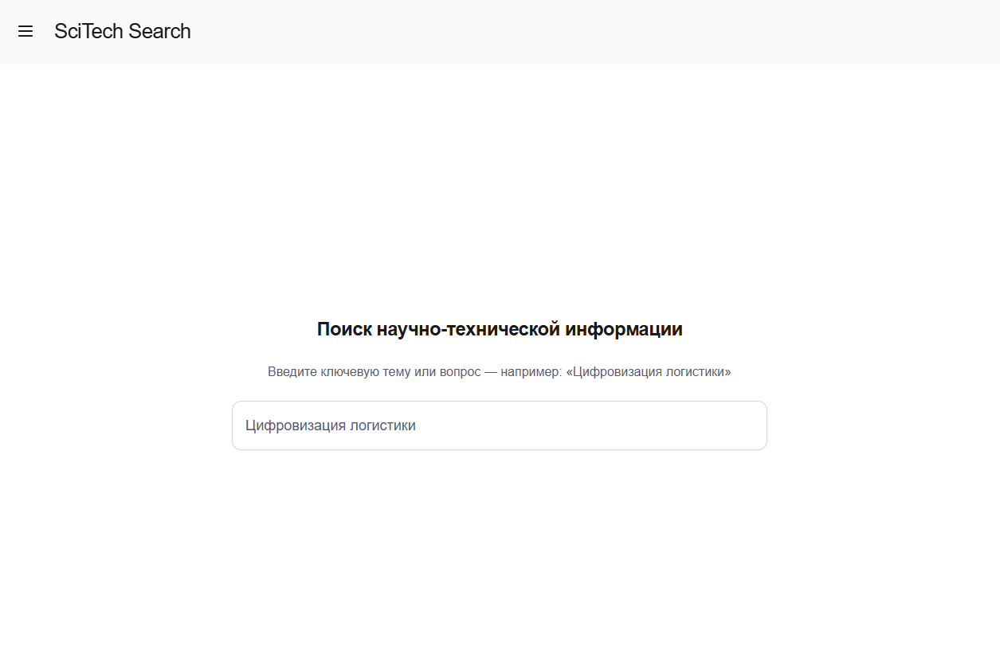
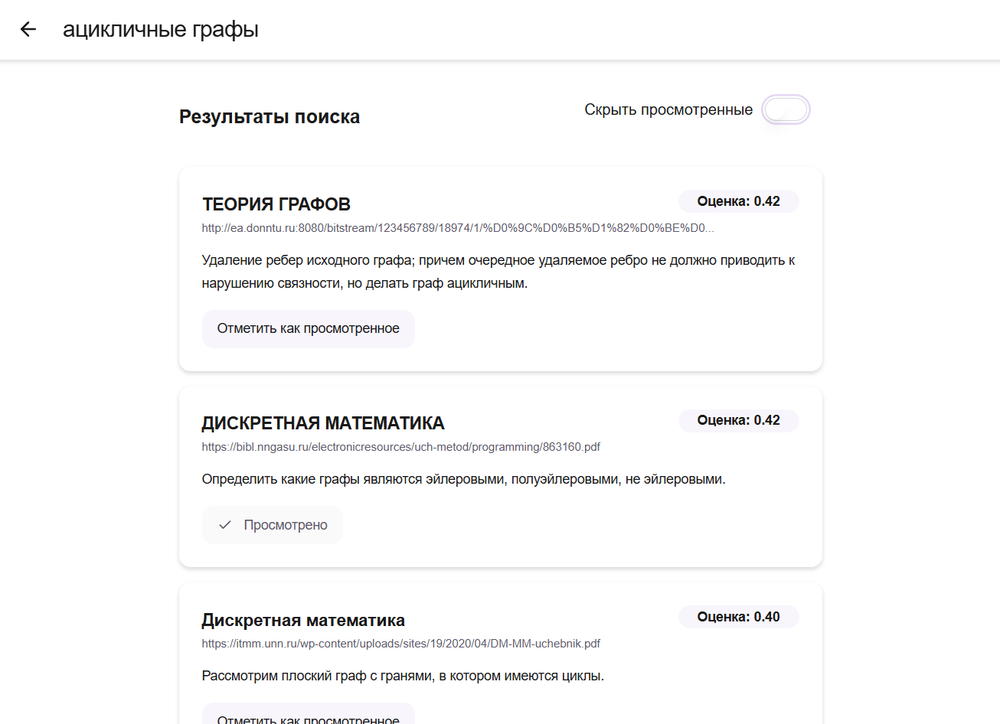

# SciTechSearchUI

Веб-интерфейс для прототипа системы семантического поиска научно-технической информации [SciTechSearchEngine](https://github.com/Gearsy93/SciTechSearchEngine). Обеспечивает интерактивное взаимодействие с пользователем, отображение результатов поиска, управление сессиями и визуализацию процессов поиска в реальном времени.

## Основной функционал

- **Форма ввода поискового запроса** позволяет пользователю вводить запросы для поиска научно-технической информации.
- **Отображение результатов поиска**:
    - Список найденных документов с краткими рефератами;
    - Оценки релевантности для каждого документа;
    - Скрытие просмотренных документов.
- **Управление сессиями поиска**:
    - Отслеживание истории запросов пользователя;
    - Сохранение состояния сессии;
    - Возможность получения списка просмотренных документов за всю сессию поиска.
- **Визуализация статуса поиска**:
    - Интеграция с WebSocket для отображения прогресса выполнения поиска в реальном времени;
    - Индикация этапов обработки запроса и получения результатов.
- **Адаптивный дизайн**: интерфейс оптимизирован для различных устройств и экранов.

## Технологии

- **Фреймворк**: [Next.js](https://nextjs.org/) – серверный рендеринг и маршрутизация;
- **Язык программирования**: TypeScript;
- **Стилизация**: Tailwind CSS – утилитарный CSS-фреймворк для быстрого стилизования компонентов;
- **Управление состоянием**: React Hooks и Context API;
- **Коммуникация с бэкендом**:
    - REST API для отправки запросов и получения результатов;
    - WebSocket для получения обновлений статуса поиска в реальном времени;